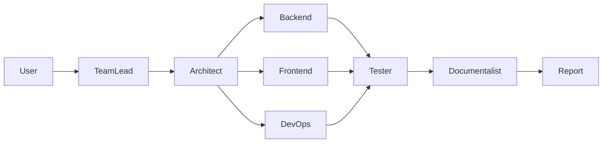

# 🤖 AI Team System

**Мультиагентная система разработки ПО** — 7 AI агентов создают проекты по описанию.


[](https://github.com/owerevolf/ai-team-system)
[](https://github.com/owerevolf/ai-team-system)

---

## ⚡ Установка в 1 команду

### Linux / Mac
```bash
curl -fsSL https://raw.githubusercontent.com/owerevolf/ai-team-system/main/scripts/install.sh | bash
```

### Windows
Скачай и запусти: [setup.bat](https://raw.githubusercontent.com/owerevolf/ai-team-system/main/scripts/setup.bat)

### Docker
```bash
docker run -p 5000:5000 -v ~/projects:/app/projects ghcr.io/owerevolf/ai-team-system:latest
```

---

## 🌟 Почему AI Team System?

| Фича | AI Team System | CrewAI | AutoGen | OpenDevin |
|------|:---:|:---:|:---:|:---:|
| Полностью локально (Ollama) | ✅ | ❌ | ❌ | ❌ |
| 7 специализированных агентов | ✅ | ❌ | ❌ | ✅ |
| Параллельная разработка | ✅ | ❌ | ✅ | ❌ |
| Web UI Dashboard | ✅ | ❌ | ❌ | ✅ |
| Бесплатные API (5+) | ✅ | ❌ | ❌ | ❌ |
| Auto-fix кода | ✅ | ❌ | ❌ | ✅ |
| Security Scan | ✅ | ❌ | ❌ | ❌ |
| One-click установка | ✅ | ❌ | ❌ | ❌ |
| Long-term memory | ✅ | ✅ | ❌ | ❌ |
| RAG система | ✅ | ❌ | ❌ | ❌ |

---

## ✨ Возможности

### 🤖 Агенты
- **7 AI агентов** — TeamLead, Architect, Backend, Frontend, DevOps, Tester, Documentalist
- **Параллельная разработка** — Backend, Frontend, DevOps работают одновременно
- **Разные модели на агента** — TeamLead на дешёвой, Backend на мощной

### 🧠 Интеллект
- **Long-term memory** — агенты запоминают прошлые проекты
- **RAG система** — поиск по шаблонам и документации
- **Auto-fix** — автоматическое исправление ошибок в коде
- **Fallback моделей** — если одна модель не работает, пробует другую

### 🛡️ Безопасность
- **Sandbox** — проверка кода перед выполнением
- **Security Scan** — bandit + safety + поиск секретов
- **Command whitelist** — только безопасные shell команды

### 🖥️ Интерфейс
- **Pipeline Dashboard** — визуальный прогресс в реальном времени
- **Reasoning Trace** — отслеживание хода мыслей агентов
- **CLI** — управление из терминала
- **SSE** — real-time события

### 🚀 Инфраструктура
- **Docker** — запуск в контейнере
- **One-click установка** — Linux, Mac, Windows
- **CI/CD** — GitHub Actions
- **ZIP Export** — экспорт проекта

---

## 🏗️ Архитектура



```
User → TeamLead → Architect → [Backend, Frontend, DevOps] → Tester → Documentalist → Report
```

---

## 👥 Агенты

| Агент | Роль | Модель (medium) |
|-------|------|-----------------|
| 👑 TeamLead | Координатор | qwen2.5-coder:7b |
| 🏗️ Architect | Архитектор | qwen2.5-coder:7b |
| ⚙️ Backend | Серверный код | qwen2.5-coder:7b |
| 🎨 Frontend | UI | qwen2.5-coder:7b |
| 🚀 DevOps | Docker, CI/CD | qwen2.5-coder:7b |
| 🧪 Tester | Тесты | qwen2.5-coder:7b |
| 📝 Documentalist | Документация | qwen2.5-coder:7b |

---

## 🚀 Быстрый старт

```bash
git clone https://github.com/owerevolf/ai-team-system.git
cd ai-team-system
./scripts/install.sh  # или scripts\setup.bat на Windows
```

### Запуск

```bash
# Web UI
python web_ui/app.py
# http://localhost:5000

# CLI
python -m core.main --project-name myapp --requirements "REST API на FastAPI"

# Интерактивный режим
python -m core.main -i --project-name myapp --requirements "описание"

# Dry-run (без LLM)
python -m core.main --dry-run --project-name myapp --requirements "описание"
```

---

## 📦 Поддерживаемые модели

### Локальные (Ollama)
- qwen2.5-coder:3b / 7b / 32b
- codellama:7b / 13b
- llama3.2:3b

### Бесплатные API
- **Groq** — llama-3.3-70b (30 RPM)
- **DeepSeek** — deepseek-chat (5M tokens free)
- **Google AI** — gemini-2.0-flash (бесплатно)
- **OpenRouter** — deepseek-r1:free
- **xAI** — grok-4 ($25 кредитов)

### Платные API
- **Anthropic** — claude-3.5-sonnet
- **OpenAI** — gpt-4o

---

## ⚙️ Профили железа

| Профиль | RAM | VRAM | Агенты | Модели |
|---------|-----|------|--------|--------|
| Light | 8GB | 4GB | 2 | 3B параметры |
| Medium | 16GB | 8GB | 4 | 7B параметры |
| Heavy | 32GB+ | 16GB+ | 8 | API (70B+) |

---

## 📁 Структура проекта

```
ai-team-system/
├── core/                  # Ядро системы
│   ├── main.py           # Оркестратор
│   ├── agent_manager.py  # Управление агентами
│   ├── model_router.py   # Маршрутизация LLM
│   ├── memory.py         # Long-term memory
│   ├── rag.py            # RAG система
│   ├── event_bus.py      # Event-driven bus
│   ├── sandbox.py        # Code sandbox
│   └── reasoning_trace.py # Reasoning trace
├── prompts/roles/        # Промпты 7 агентов
├── web_ui/               # Flask веб-интерфейс
├── tests/                # 58+ тестов
├── scripts/              # Install скрипты
└── templates/            # Шаблоны проектов
```

---

## 🗺️ Roadmap

### v5.0 (сейчас)
- ✅ Per-agent model config
- ✅ Long-term memory
- ✅ RAG system
- ✅ Event bus
- ✅ Agent sandbox
- ✅ Reasoning trace

### v5.1 (планируется)
- [ ] Kanban dashboard
- [ ] MCP server support
- [ ] Self-improving agents
- [ ] Multi-user collaboration

### v6.0 (будущее)
- [ ] LangGraph integration
- [ ] Auto-deploy to Vercel/Render
- [ ] Voice interface (Whisper)
- [ ] Plugin marketplace

---

## 🤝 Контрибьют

1. Fork репозитория
2. Создай ветку (`git checkout -b feature/amazing`)
3. Коммит (`git commit -m 'feat: add amazing'`)
4. Push (`git push origin feature/amazing`)
5. Pull Request

---

## 📄 Лицензия

MIT

---

**Made with ❤️ by AI Team System — полностью написано AI агентами**
